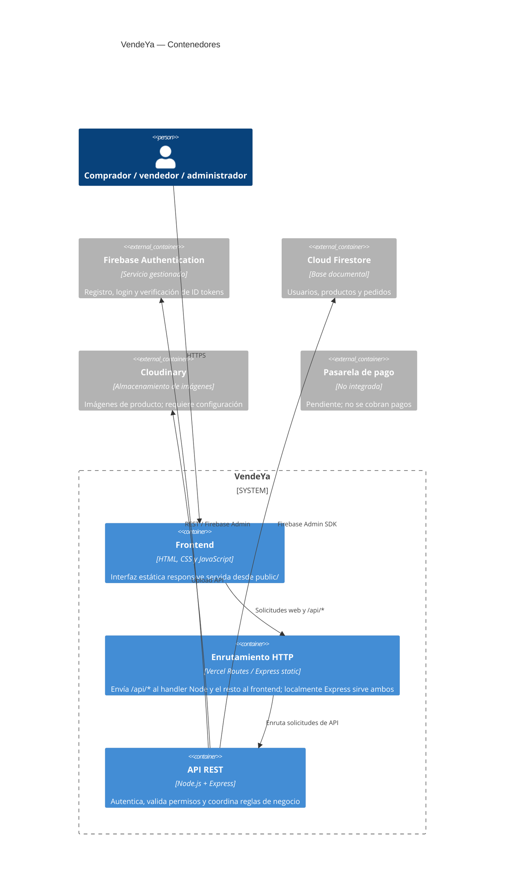

# C2 — Contenedores

```mermaid
C4Container
  title VendeYa — Contenedores
  Person(user, "Comprador / vendedor / administrador")
  System_Boundary(market, "VendeYa") {
    Container(web, "Frontend", "HTML, CSS y JavaScript", "Interfaz estática responsive servida desde public/")
    Container(proxy, "Enrutamiento HTTP", "Vercel Routes / Express static", "Envía /api/* al handler Node y el resto al frontend; localmente Express sirve ambos")
    Container(api, "API REST", "Node.js + Express", "Autentica, valida permisos y coordina reglas de negocio")
  }
  Container_Ext(auth, "Firebase Authentication", "Servicio gestionado", "Registro, login y verificación de ID tokens")
  Container_Ext(db, "Cloud Firestore", "Base documental", "Usuarios, productos y pedidos")
  Container_Ext(images, "Cloudinary", "Almacenamiento de imágenes", "Imágenes de producto; requiere configuración")
  Container_Ext(pay, "Pasarela de pago", "No integrada", "Pendiente; no se cobran pagos")
  Rel(user, web, "HTTPS")
  Rel(web, proxy, "Solicitudes web y /api/*")
  Rel(proxy, api, "Enruta solicitudes de API")
  Rel(api, auth, "REST / Firebase Admin")
  Rel(api, db, "Firebase Admin SDK")
  Rel(api, images, "Upload API")
```

En Vercel, `vercel.json` enruta `/api/*` a `api/index.js` y los demás recursos a `public/`. En local, `server.js` monta la misma aplicación Express.
