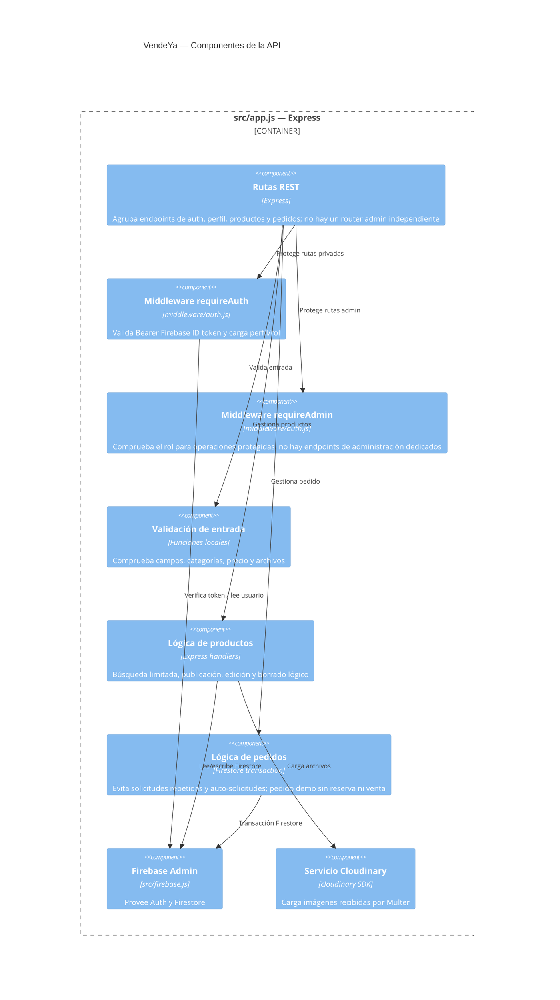

# C3 — Componentes del backend

```mermaid
C4Component
  title VendeYa — Componentes de la API
  Container_Boundary(api, "src/app.js — Express") {
    Component(routes, "Rutas REST", "Express", "Agrupa endpoints de auth, perfil, productos y pedidos; no hay un router admin independiente")
    Component(authMw, "Middleware requireAuth", "middleware/auth.js", "Valida Bearer Firebase ID token y carga perfil/rol")
    Component(adminMw, "Middleware requireAdmin", "middleware/auth.js", "Comprueba el rol para operaciones protegidas; no hay endpoints de administración dedicados")
    Component(validation, "Validación de entrada", "Funciones locales", "Comprueba campos, categorías, precio y archivos")
    Component(productLogic, "Lógica de productos", "Express handlers", "Búsqueda limitada, publicación, edición y borrado lógico")
    Component(orderLogic, "Lógica de pedidos", "Firestore transaction", "Evita solicitudes repetidas y auto-solicitudes; pedido demo sin reserva ni venta")
    Component(firebase, "Firebase Admin", "src/firebase.js", "Provee Auth y Firestore")
    Component(imageStore, "Servicio Cloudinary", "cloudinary SDK", "Carga imágenes recibidas por Multer")
    Rel(routes, authMw, "Protege rutas privadas")
    Rel(routes, adminMw, "Protege rutas admin")
    Rel(routes, validation, "Valida entrada")
    Rel(routes, productLogic, "Gestiona productos")
    Rel(routes, orderLogic, "Gestiona pedido")
    Rel(authMw, firebase, "Verifica token / lee usuario")
    Rel(productLogic, firebase, "Lee/escribe Firestore")
    Rel(orderLogic, firebase, "Transacción Firestore")
    Rel(productLogic, imageStore, "Carga archivos")
  }
```

Los componentes siguen concentrados en `src/app.js` (375 líneas); esta documentación describe responsabilidades lógicas, no routers separados.

